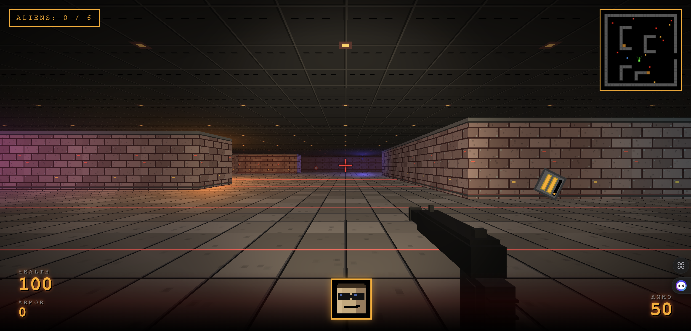

# NUKE 3D

> A retro first-person shooter in a single HTML file. No build step, no dependencies to install — just open it and play.



## About

**NUKE 3D** is a tribute to classic '90s corridor shooters like *Duke Nukem 3D* and *Doom*. The entire game — engine, level, enemies, weapons, audio, HUD — lives in a single self-contained `index.html` file. All textures are procedurally drawn to canvases at startup, so there are no image assets to ship.

You wake up in a neon-lit underground complex. Six aliens between you and the exit. Your pistol holds 12 rounds; pickups are scarce; the lights flicker. Have fun.

## Features

- **Pure Three.js (r128)** 3D scene with dynamic lighting
- **Procedural textures** — brick walls, tile floor, ceiling, and pickup icons are all drawn to HTML5 canvases at load time
- **Headlamp spotlight** parented to the camera so dark corners stay playable
- **First-person 3D weapon** with bob, recoil, and a real-time muzzle-flash light
- **AI enemies** with patrol and alert states
- **Pooled bullets and particles** for stable framerate
- **Pointer-lock mouse look** with auto re-lock on click
- **Web Audio synth** — every sound (shoot, hit, pickup, hurt, enemy alert) is generated on the fly
- **Live minimap** with view-cone indicator
- **HUD**: health, armor, ammo, face portrait that grimaces as you take damage, damage vignette
- **Doors** that open with a keypress
- **Pickups**: health, armor, and ammo scattered around the map

## Controls

| Key       | Action             |
|-----------|--------------------|
| `W` `A` `S` `D` / Arrows | Move          |
| Mouse     | Look               |
| Left click | Shoot             |
| `E`       | Open / close doors |
| `Esc`     | Release mouse      |

## How to run

Because the game uses pointer lock and the Web Audio API, it has to be served over `http://` rather than opened as a `file://` URL.

```bash
# From the repo root
python3 -m http.server 8000
# then open http://localhost:8000 in any modern browser
```

Or just drop `index.html` behind any static file server (nginx, Caddy, GitHub Pages, etc.). No `npm install`, no bundler, no transpilation.

## Project structure

```
.
├── index.html      # The entire game (HTML + CSS + JS)
├── screenshot.png  # In-game screenshot for the README
└── README.md
```

The game code is organized into sections inside one `<script>` block:

- **Globals & state** — player, enemies, bullets, particles, pickups, doors
- **Procedural texture generators** — brick, tile, ceiling, door, enemy, pickup
- **`initThree()`** — scene, camera, renderer, lights, weapon
- **`buildLevel()`** — walls, floor, ceiling, neon point lights
- **`initPools()`** — bullet and particle object pools
- **`updatePlayer()` / `updateEnemies()` / `updateBullets()` / …** — per-frame logic
- **`gameLoop()`** — fixed-dt main loop

## Map format

The level is a 24×24 ASCII grid inside `index.html`:

| Char | Meaning       |
|------|---------------|
| `#`  | Wall          |
| `.`  | Floor         |
| `D`  | Door (openable) |
| `H`  | Health pickup |
| `A`  | Ammo pickup   |
| `V`  | Armor pickup  |
| `E`  | Enemy spawn   |
| `P`  | Player spawn  |

Edit the `LEVEL_DATA` array to make your own map — the rest of the engine will pick it up automatically.

## Tech stack

- [Three.js](https://threejs.org/) r128 (CDN)
- Vanilla JavaScript (ES2015+)
- HTML5 Canvas for textures
- Web Audio API for sound
- No build tools, no frameworks, no package.json

## License

MIT. See [LICENSE](LICENSE) if present, otherwise the standard MIT terms apply — do what you want, no warranty.

## Credits

- Game design, code, and art: the author
- Engine inspiration: *Duke Nukem 3D* (3D Realms, 1996) and *Doom* (id Software, 1993)
- Three.js: [mrdoob and contributors](https://github.com/mrdoob/three.js/)
